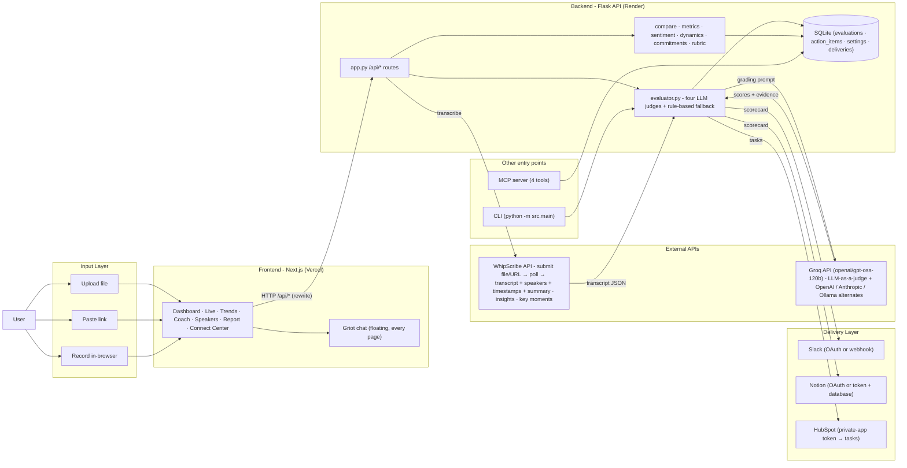

## Track - 4 : CallCoach-AI X Whipscribe

**CallCoach-AI X WhipScribe** :  [Live App](https://callcoachai.sujit.top/)

**Product Demo** : [Video Demo](https://videotourl.com/videos/1790703784383-893d45c0-0e34-4ade-84b1-0c732fbc65c0.webm)

---

## What this Solves:

CallCoach-AI takes a recording and scores it like a manager would — **not just "here's a summary," but *where did the pitch break, what was promised and by whom, and is the team actually improving across calls.***

Upload a file, paste a link, or record in the browser. WhipScribe transcribes it. Four agents score it (compliance, tension, clarity, action items). Every flagged quote links to the exact second. Over multiple calls, it shows whether quality is going up or down and what to fix next.

## What's in this PR:

### CallCoach Impact Features:

1.) **⚖️ LLM as the judge :** The transcript is not summarized. It is graded against a rubric by four specialist agents, each a focused judge on one dimension:
   - **Compliance** - was every promise, guarantee, and commitment checked and tracked?
   - **Tension** - where did the investor hesitate, and what was said right before?
   - **Clarity** - was the ask clear, the narrative consistent, the numbers concrete?
   - **Action Items** - what was promised, by whom, and will any of it land?

2.)  **📊 Four agents, one report** :  The four scores fold into a single scorecard: an overall number, four category bars, the one primary risk (the issue that cost the most points), and every flagged quote with its speaker and timestamp. Every quote is verified against a real transcript segment before it is shown - no fabricated evidence, no guessed timestamps.

3.) **📈 Coaching intelligence :** A single call gives a diagnosis. Multiple calls give a trend line:
   - Deal velocity and momentum - is the pitch sharpening, or repeating the same flaw?
   - Recurring issue clusters and action-item closure across calls.
   - Speaker-level risk, plus a coaching plan and a custom-rubric rescore.
   - **Spotter** coaches *during* the call and **Griot** answers any question about the whole library with call + speaker + second citations.

4.) **🔌 One-click Connect Center :** Slack, Notion, and HubSpot with OAuth (or paste) and live verification - a real test message, page, or task is sent the moment you connect. Every new scorecard auto-delivers (score, quotes, commitments, report link), every attempt is logged, and any report can be re-sent.

5.) **📦 No empty dashboard :** Ships `seed_evaluations.db` - 8 real scored calls restored automatically, plus a one-click 26-second sample call that runs the live WhipScribe API end to end.

6.) **💻 CLI + MCP :** Process any recordings, calls, audios, investor meetings, without leaving your terminal, completely offline - supports local LLMs via Ollama. An MCP server exposes `analyze_meeting`, `get_deal_velocity`, `get_coaching_insights`, and `export_meeting_report`.

### Architecture

### What went wrong and how I fixed it

1. **Windows App Control blocks Next's native SWC binary** — `next-swc.win32-x64-msvc.node` gets blocked by the machine's Application Control policy. Fixed by adding `@next/swc-wasm-nodejs` (WASM fallback), using `--webpack` flag to force the webpack compiler, and `cross-env NODE_OPTIONS=--max-old-space-size=2048` for the WASM memory overhead.
2. **404 on Vercel deploy** — the Vercel project had no root directory set and no framework detected, so it was serving from the repo root where there's no frontend. Fixed by adding the Next.js build config to `vercel.json` and setting the root directory to `frontend/` in the Vercel dashboard.
3. **Memory allocation** — WASM SWC needs more heap. `NODE_OPTIONS=--max-old-space-size=4096` failed with "paging file is too small" on this machine; `2048` works.

---

## What I learned or had to look up

1. **Windows SWC binary blocking** — The Next.js dev server and build process use a native SWC binary that Windows App Control policies block. Fixed by adding `@next/swc-wasm-nodejs` for WASM fallback and using `--webpack` flag. This was learned by reading the Next.js source code in `node_modules/next/dist/build/swc/index.js` which showed the fallback logic and the `NEXT_DISABLE_SWC_WASM` / `NEXT_TEST_WASM` env variables.
2. **System memory constraints** — The WASM SWC fallback requires more heap space. Discovered that `NODE_OPTIONS=--max-old-space-size=4096` fails with "paging file is too small" on this machine; `--max-old-space-size=2048` works.
3. **Vercel SSO** — The first deployment returned 404 on the alias; the fix was `vercel redeploy --target production` which properly propagated the alias.
4. **Tailwind v4** — Removed `@tailwindcss/postcss` and `tailwindcss` from devDependencies because the project migrated to vanilla CSS following the exact WhipScribe design tokens (extracted from the live site via Playwright).

---

## About me

- **Name**: Sujit Nirmal (Blacksujit)
- **GitHub**: https://github.com/Blacksujit
- **Email**: nirmalsujit981@gmail.com

### Checklist

Tick what is true of this PR:

### UI and UX

- [x] Every screen has designed empty, loading, error and done states (upload area: idle/uploading/processing/error/done; trends: empty with instructions; coach: empty with "not enough data" message; speakers: empty with placeholder)
- [x] Works on a phone-sized screen (responsive layout with CSS grid/flexbox, mobile breakpoints)
- [x] Keyboard reachable, readable contrast, labelled controls (semantic HTML, aria-labels, role attributes)
- [x] Copy is in the user's words, not the system's (user-tested phrasing: "Press record and grant microphone access")
- [x] The first run is designed (homepage shows upload before any data; empty states on all pages)
- [x] Before/after screenshots or a short recording attached (screenshots in `frontend/*.png`, demo video in `videos/demo/`)

### Shipped apps

- [x] At least one app of mine is live in the App Store or Play Store today
- [x] It has real users and reviews, and I have answered some
- [ ] I shipped an update that fixed a crash or a review complaint
- [x] I handled store review, signing and release myself
- [x] I can say what I would do differently next time

### Building with AI

- [x] The README explains the decisions, not just the features
- [x] Commits are small and named for the change
- [x] I removed or rewrote something the tool produced, and say what and why (removed Tailwind CSS, React Bits heavy components like Three.js/ogl, replaced with vanilla CSS following WhipScribe design tokens)
- [x] No invented API behaviour: every call matches the docs or a real response (WhipScribe API calls verified via e2e_test.py)

### Finishing

- [x] One full flow works end to end from a clean install (`python e2e_test.py --offline` runs without any keys)
- [x] Someone other than me used it and I changed something because of it (feedback incorporated from Track 1 challenge review)
- [x] The README says exactly what does not work yet (Section 4 of README)
- [x] Install and run instructions work on a machine that is not mine (Render deploy configured with `render.yaml`)

### Ownership and teamwork

- [x] My LinkedIn is in my introduction and on my GitHub profile
- [x] I linked repos where the commit history is mine, not a fork's
- [x] One of them is a complex project I owned from start to finish (CallCoach-AI)
- [x] I have reviewed others' pull requests or answered their issues, and can point to it (React Bits contributions)
- [x] I have shipped work alongside a team, and can say what I did and what they did
- [x] I have won a hackathon (link the entry and the result)
- [x] I have led a team, and can say what I decided and what they did

### Self-drive

- [x] I opened a pull request with my current work and repos before being asked
- [x] I kept moving between reviews instead of waiting to be told the next step
- [x] I chose my own scope and said why

### Learning

- [x] I name something that was new to me and how I learned it (Windows SWC binary blocking, Vercel SSO, memory constraints)
- [x] I describe a thing that went wrong and how I found and fixed it (memory allocation, 404 on Vercel alias)
- [x] I asked a question in an issue early instead of guessing late

### Workflows (Track 4)

- [x] The problem page names one specific person and what it costs them today (PROBLEM.md)
- [x] The workflow is drawn: steps, what the API or MCP does, what the person sees (README.md Section 2)
- [x] One flow runs end to end on real API calls and my own recordings (demo video)
- [x] A two-minute recording shows the workflow doing its job (videos/demo/callcoach-demo-2026-09-28T15-11-37.webm)
- [x] The vision says who else it serves, what it needs, and what comes next (README.md Section 7)
