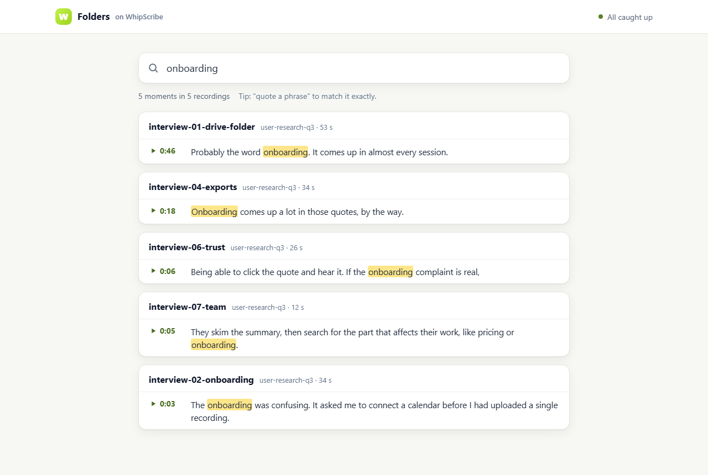
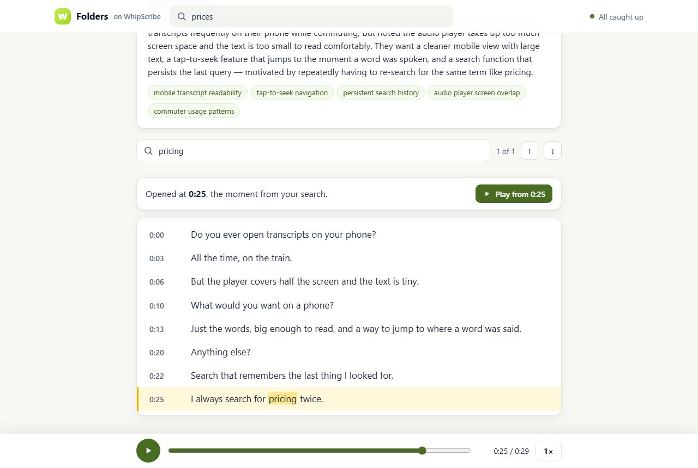
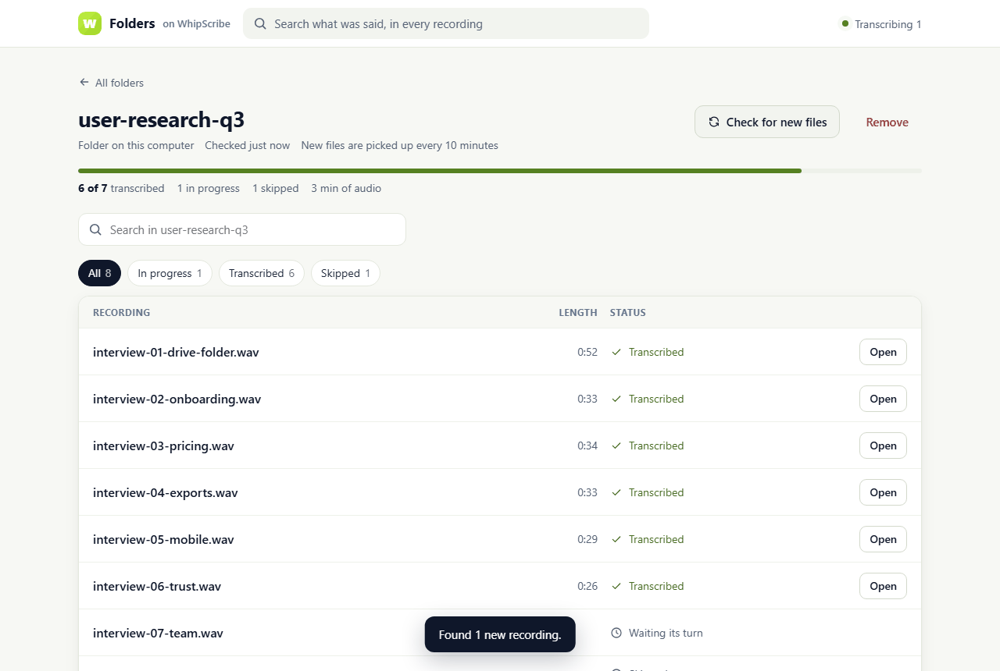
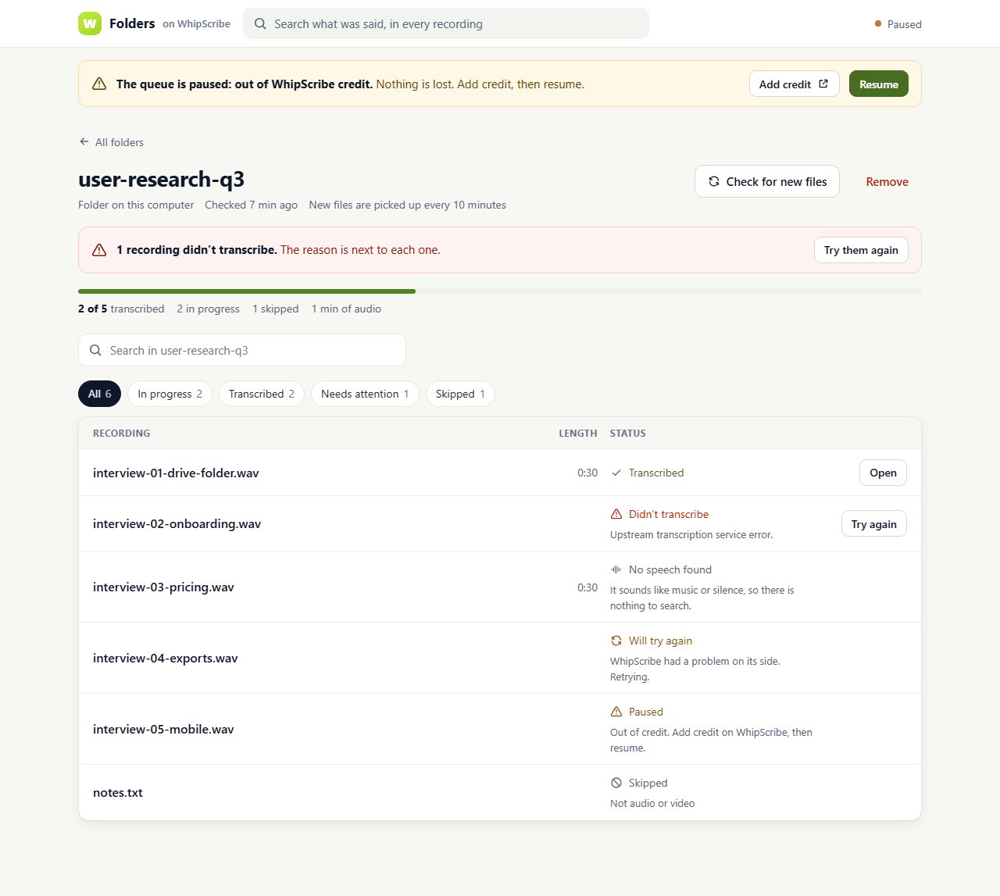

# Folders: Google Drive in, searchable transcripts out

Track 3 of the WhipScribe Buildathon · Nevil Sonani

You pick a Drive folder and every recording in it is transcribed by WhipScribe,
with progress per file. New files are picked up later. Then you search what was
said across all of it, and each result opens at the second it was said, ready
to play.

<table><tr>
<td></td>
<td></td>
</tr><tr>
<td></td>
<td></td>
</tr></table>

## What works

Checked end to end against the real WhipScribe API (guest tier), with a folder
of recordings on this computer:

- **Pick a folder, see before you commit.** The picker shows how many
  recordings are inside and their total size, and which files will be left out
  and why ("notes.txt: not audio or video"), before anything is sent.
- **Progress per file.** Each file shows its own step: waiting its turn,
  copying, sending to WhipScribe, transcribing (with WhipScribe's percentage),
  then done. Two files move at a time.
- **Survives the tab closing, and a restart.** The queue runs on the server
  and lives in SQLite. After a restart, a file that was mid-upload is sent
  again with the same `Idempotency-Key`, so WhipScribe returns the job it
  already made instead of charging twice.
- **Picks up new files.** Each folder is checked every 10 minutes, or straight
  away with *Check for new files*:
  - new files join the queue ("Found 1 new recording.");
  - changed files are transcribed again;
  - deleted files keep their transcript and say they are gone from the source.
- **Search.** One box searches every folder, or one folder.
  - *price* finds *pricing* (stemming), "quoted phrases" match exactly, and
    the last word matches as you type.
  - Results are grouped by recording, with the words that matched marked.
- **Jump to the moment.** A result opens the transcript scrolled to that line
  and marked, with the matching words highlighted, the player at that second
  and a *Play from 0:25* button. Browsers block autoplay, so it waits for a tap.
- **Transcript page:**
  - WhipScribe's summary and topics;
  - find in the transcript;
  - play from any line, with the line being played shaded;
  - a player that fetches a fresh audio link if the old one expires mid-listen.
- **Every state is designed:**
  - the first run, before any data;
  - an empty folder and a folder with nothing to transcribe;
  - in progress;
  - failed, with WhipScribe's reason and *Try again*;
  - retrying after a hiccup;
  - the whole queue paused when credit or free minutes run out, or Drive needs
    a new sign-in, with *Resume*;
  - no speech found, preview only (locked), skipped with the reason, and gone
    from the source;
  - the app itself unreachable.
- **Phones.** Every screen works at 390 px; the file list and the transcript
  re-flow into one column.

Written against Google's documentation but **not yet run against a real Google
account**, because it needs an OAuth client (next section):

- Drive sign-in: authorization code with PKCE and read-only scope;
- browsing My Drive and Shared with me;
- recursive listing;
- streamed downloads.

The local-folder source goes through the same worker, so everything after the
download is tested.

## Run it

Node 22.13 or newer (tested on 24.11). No database to install: it uses the
SQLite that ships with Node.

```bash
cd apps/nevil-sonani/drive-search
npm install
cp .env.example .env.local      # then edit it, see below
npm run build
npm start                       # http://localhost:3000
```

To try it without Google, point `DEMO_FOLDER` in `.env.local` at a folder whose
subfolders hold recordings (mp3, m4a, wav, mp4, mov, ogg, webm, flac). Each
subfolder can then be picked like a Drive folder. Without `WHIPSCRIBE_API_KEY`
the app uses WhipScribe's free guest tier: it works, with a daily limit, but
the transcripts are not saved to your WhipScribe account.

`npm test` runs the tests; `npm run typecheck` checks the types.

## Connect Google Drive (about five minutes)

1. Go to [console.cloud.google.com](https://console.cloud.google.com) and
   create a project.
2. **APIs & Services → Library**: enable **Google Drive API**.
3. **OAuth consent screen**:
   - choose External;
   - give it a name and your email;
   - add the scope `https://www.googleapis.com/auth/drive.readonly`;
   - under **Test users**, add your own Google account.
4. **Credentials → Create credentials → OAuth client ID → Web application**.
   Under *Authorized redirect URIs* add `http://localhost:3000/api/google/callback`
   (it must match `APP_URL`).
5. Put the client ID and secret in `.env.local` as `GOOGLE_CLIENT_ID` and
   `GOOGLE_CLIENT_SECRET`, then restart.

While the app is in Google's "testing" mode, sign-ins last 7 days. After that
the queue pauses and asks you to connect again; nothing is lost.

## How it works

```
Drive folder ──scan every 10 min, or "Check now"──▶ files table (SQLite)
                                                        │ queued
                                  download to a temp file (streamed)
                                                        │
                POST /v1/transcribe  (multipart, Idempotency-Key per file version)
                                                        │ transcribing
                GET /v1/jobs/{id} every 3 s  ──done──▶ GET /v1/jobs/{id}/result?format=json
                                                        │
                                  segments ──▶ full-text index (FTS5, porter stemming)
                                                        │
search box ──▶ /api/search ──▶ results ──▶ /files/{id}?t=25 ──▶ <audio> ◀── GET /v1/jobs/{id}/audio/url
```

| Where | What |
|---|---|
| `src/lib/worker.ts` | The queue: transfers, polling, retries with backoff, pausing, resuming after a restart. |
| `src/lib/whipscribe.ts` | The API client. Error codes in the docs become sentences a person can act on. |
| `src/lib/sources/` | Google Drive and the local demo folder, behind one small interface. |
| `src/lib/scan.ts` | What is new, changed, gone or skipped in a folder. |
| `src/lib/search.ts` | Turns what people type into a safe FTS5 query; results grouped by file. |
| `src/components/` | The screens. `FileState.tsx` is the one place a status becomes words. |

## Decisions, and why

- **My own Drive OAuth client, not WhipScribe's Drive connector.** The
  connector (`/v1/connectors/drive/*`) is early access and switched on per
  account, and the brief asks for our own client. Everything Drive-specific is
  in `sources/drive.ts`, so moving to the connector later is one file.
- **`drive.readonly` and a folder browser of my own, not the Google Picker.**
  "Picks up new files later" means reading a folder's contents again, without
  the person there, and the Picker's narrower `drive.file` scope does not give
  that. The cost is a restricted scope that Google must verify before a public
  launch; for a product this belongs with WhipScribe's own connector.
- **A local full-text index, not WhipScribe's library search.**
  `/v1/library/search` is in the OpenAPI file but not in the public docs, and
  the brief says not to build on behaviour the docs don't show. The local
  index also keeps the time of every line, which is what "jump to the moment"
  needs.
- **Segment times, not word times.** The API returned `words: null` for my
  recordings ([what it returned](docs/real-responses.md)), so the moment is
  the start of the matching segment.
- **Only the formats the API docs list are sent.** Anything else is skipped
  with the reason on screen, rather than uploaded and left to fail.
- **Polling every 3 seconds**, the cadence the docs recommend. Webhooks are
  for the Enterprise tier.
- **Out of credit or free minutes pauses the whole queue**, rather than
  failing every file one by one. The file stays first in line, and *Resume*
  carries on.
- **A retry after WhipScribe failed a job gets a new Idempotency-Key.** The
  key is `file id + file version + retry round`. The same key would return the
  failed job again; a new version or an explicit retry should start fresh.
- **Node's built-in SQLite**, so `npm install` has no native module to compile
  on someone else's machine.
- **No login.** It is one person's app on their own computer. State-changing
  routes refuse requests from other origins, so a web page open in the same
  browser cannot drive it.

## What does not work yet

- **Real Google Drive: not tested yet.** It needs an OAuth client (above).
  The code follows the Drive v3 and OAuth documentation, but I will only call
  it working once I have run it.
- **Not yet run with an API key.** I am waiting for the buildathon credit
  coupon; the guest tier is tested. With a key the same calls go out with
  `X-API-Key`, as the docs show.
- **Asking a question across a folder (the stretch): not built.** The obvious
  path is WhipScribe's chat, but `/v1/jobs/{id}/chat` is not in the public
  docs. I would rather ask how it is meant to be used than guess.
- **Uploading shows no percentage.** Node's `fetch` gives no upload progress,
  so the row says *Sending to WhipScribe* with a moving bar.
- **Very large files.** They go through the multipart upload; the pre-signed
  flow (`/v1/uploads/init`) is not in the public docs. Nothing over a few MB
  has been tried.
- **Shortcuts in Drive are skipped**, not followed.
- **One server per database.** Two app processes on the same `data/` folder
  would both run the queue.
- **Node prints an ExperimentalWarning** about `node:sqlite` once at start.
  It is harmless.

## What I learned

- **Test the API before designing on it.** I sent it a real recording first
  and found four differences from the docs ([details](docs/real-responses.md)).
  Designing on the documented word timings would have built the jump feature
  on data the API did not return.
- **`node:sqlite` rows have a null prototype**, and React refuses to pass them
  from a server component to a client component. The dev server showed
  nothing; the production build failed with React error #441. The server log
  named the cause, and copying rows into plain objects fixed it.
- **FTS5 external-content tables**, with triggers to keep them in sync. A test
  checks that deleting a file also clears its lines from the index.

## How I built it

With Claude Code. The parts I rewrote or caught, and why:

- **The query sanitiser.** The first version cast objects through `unknown` to
  fit a string array. I rewrote it and added tests with injection attempts
  (`foo" OR bar*`).
- **The null-prototype rows** above.
- **A build warning.** Turbopack was tracing the whole project because of a
  dynamic path; that path is now scoped.
- **Screenshots of every screen caught three more:**
  - the file list's columns did not line up (each row was its own grid);
  - the top bar said "All caught up" while a new file was waiting;
  - a transient failure read "Paused … Retrying". Transient errors now say
    *Will try again*, and only credit, free minutes and Drive sign-in pause
    the queue.
- **Search and the transcript disagreed.** Search found *pricing* for
  "prices", then the transcript said "Not found", because it matched plain
  text. Results now carry the words the index actually matched.
- **Error states.** I checked them with a small local stand-in for the API.
  It answers with the error bodies the docs define (`402 NO_CREDITS`,
  `502 BACKEND_ERROR`, a failed job, `speech_detected: false`); it was a test
  tool and is not in this repo.
