# Mobile transcript reader — next pass

This is a dependency-free, interactive proposal for Challenge 01. Open
`index.html` directly, or serve this directory with any static server. At a
phone width the prototype fills the viewport; on a laptop it includes the
rationale and a state picker beside the phone.

The primary job is **read or listen to the moment that matters**. The design
therefore treats a speaker's name, words, and playable timestamp as one block.
At 320 px it still shows four speakers without squeezing transcript text into a
separate narrow column.

## Current / proposed

Every changed screen is paired below. The current images are the supplied
Challenge 01 reference, not a reconstruction.

| State | Current | Proposed |
|---|---|---|
| Reader at 390 px |  | 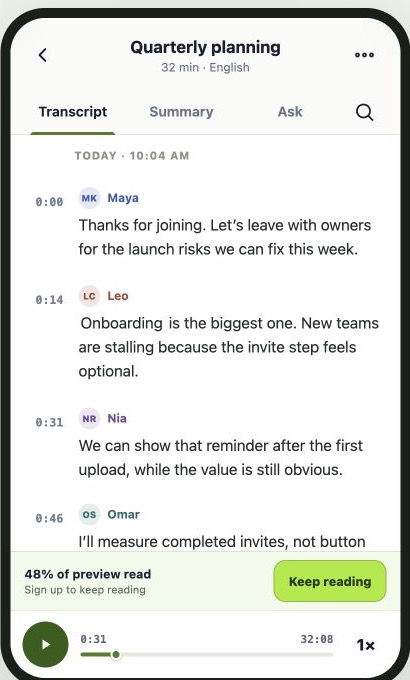 |
| Reader at 320 px |  | 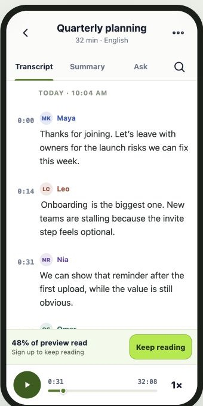 |
| Scrolled |  | 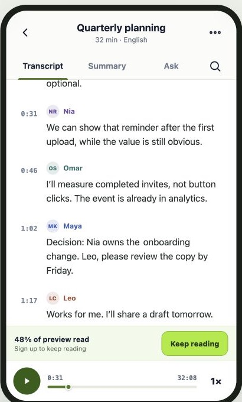 |
| Preview boundary |  | 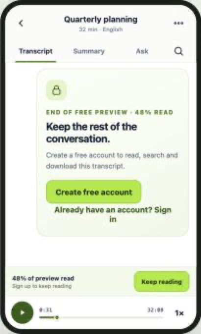 |
| Search |  | 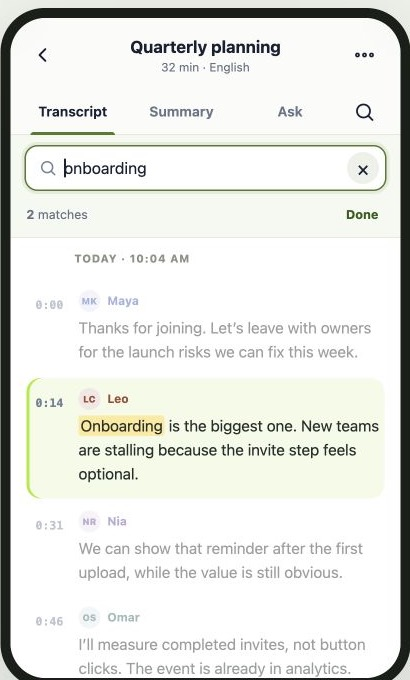 |
| More / reader tools |  | 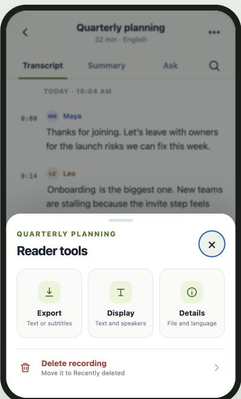 |
| Export |  | 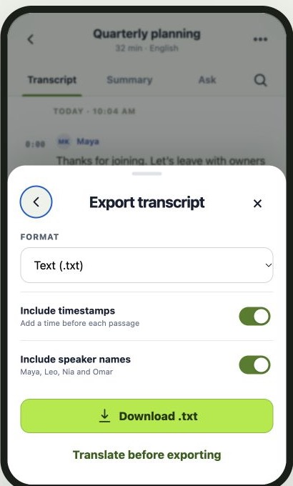 |
| Reading settings |  | 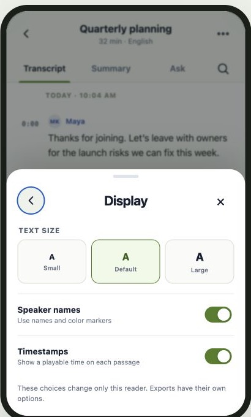 |
| Text selection |  | 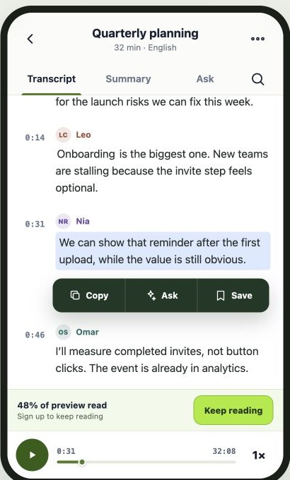 |
| Ask AI about selection | No supplied state | 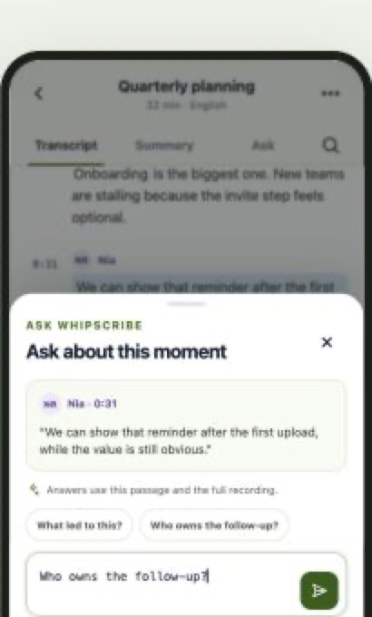 |
| Keep reading |  | 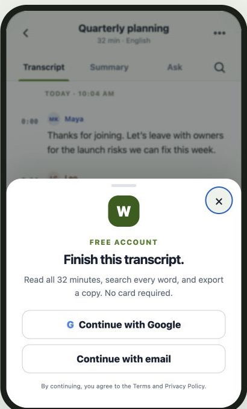 |
| Processing | No supplied state | 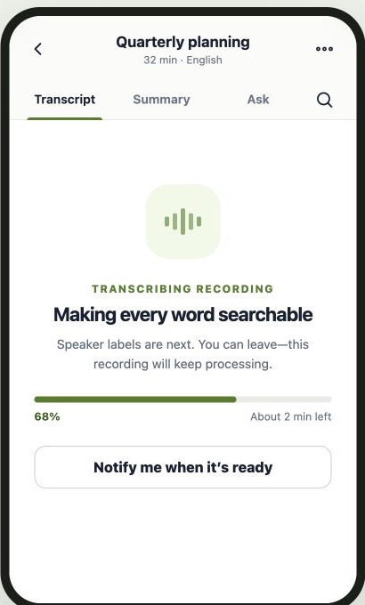 |
| Load failure |  | 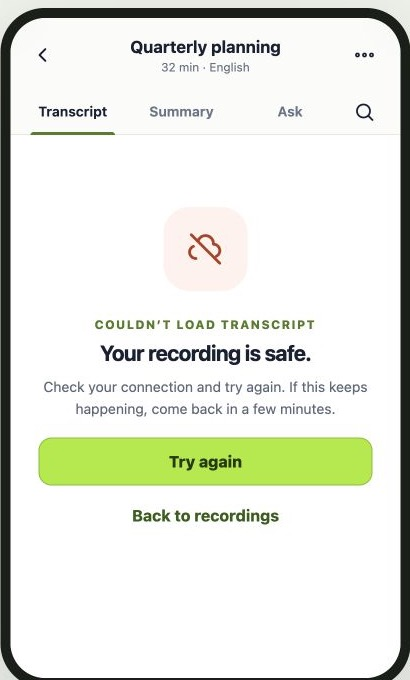 |
| Wrong account |  | 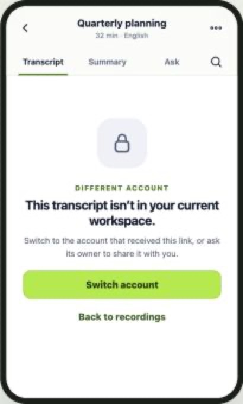 |

## What changed

### Less reader chrome

- The recording name and metadata use one compact header row.
- Transcript, Summary, and Ask remain because they are the recording's main
  modes. Search stays one tap away.
- Download, reading settings, details, and deletion are consolidated in one
  **Reader tools** sheet. Home is the back button, copy belongs to text
  selection, quiz belongs in Ask, and sign-in belongs at the preview boundary.
- Rename remains a library action rather than a reading action.

### A calmer bottom stack

- Playback is a 68 px compact bar with play, time, seek position, and speed.
- The preview prompt is a single 58 px row above it. At the actual preview
  boundary, the transcript contains a full explanation and account action.
- Search hides both bottom rows while the keyboard is expected, so results are
  not trapped between the keyboard and permanent UI.

### Four speakers at 320 px

Each passage has a colored initials marker and speaker name above the text. The
timestamp remains a small playable control. Color is redundant—not the only
way a speaker is identified.

### One panel language

Tools, export, display, and sign-up all use the same bottom-sheet shape, close
behavior, headings, and 44 px minimum controls. Export starts with one useful
choice instead of showing every format, translation, Drive, and summary option
at once. Translation is disclosed only when requested.

### Selection becomes a workflow

Selecting a passage offers **Copy**, **Ask**, and **Save**. Ask opens with the
selected speaker, timestamp, and quote already attached, plus two useful prompt
starters. The composer explains that answers can use the full recording and
will link back to evidence. Play already exists on the passage timestamp, so it
does not consume another contextual action.

### Missing states

- **Processing:** specific stage, progress, time estimate, permission to leave,
  and an optional notification action.
- **Load failure:** human copy that says the recording is safe; raw HTTP status
  is diagnostic detail, not user copy.
- **Wrong account:** names the problem and offers switch-account and back paths.

## What stayed

- Timestamps are visible by default because they connect text to audio.
- The bottom player remains persistent during ordinary reading.
- Search highlights matches and reports a count.
- Preview access is honest and visibly bounded; this proposal improves the
  interruption rather than hiding the product gate.
- Desktop keeps the same information architecture. This prototype changes the
  phone layout only; production CSS should scope the compact header, sheets,
  and bottom stack to the existing mobile breakpoint.

## States in the prototype

Use the desktop picker or append `?state=` with one of:

`reader`, `scrolled`, `preview`, `search`, `tools`, `export`, `display`,
`selection`, `ask`, `signup`, `processing`, `error`, or `account`.

## Accessibility and behavior notes

- Interactive controls are at least 44 × 44 px (the small timestamps have a
  30 px visible target inside a 42 px grid column and should be expanded to the
  whole passage hit area in production).
- Controls have accessible names, dialogs have headings, and speaker identity
  never relies on color alone.
- Contrast was chosen for readable body text and controls; focus styles remain
  visible.
- Escape closes an open sheet or search. Reduced-motion preferences disable the
  processing animation.
- In production, opening a sheet should trap focus and return it to its trigger;
  this static prototype moves focus into the sheet but does not include a full
  dialog focus-trap library.

## Deliberate limits

This is a front-end proposal, not a replacement for the live transcript page.
It uses sample meeting content and does not fetch, upload, rename, export, delete,
or authenticate anything. Playback controls demonstrate state but do not load
audio. No WhipScribe API behavior is assumed.
