# UI challenge 01: the next pass

**Nevil Sonani** · [open the prototype](reader.html) · [side by side with the current design](index.html)

A phone reader is for reading. This pass gives the words the screen, asks for
the sign-up when there is a reason to, and stops showing controls that cannot
work. It removes more than it adds.

## Open it

- **On a phone:** open `reader.html` from this folder once it is served (GitHub
  Pages on the fork, or `python -m http.server` here and your laptop's address
  on the same Wi-Fi). Everything is tappable, and every state below is
  reachable by tapping through.
- **On a laptop:** open `index.html`. Each screen shows the current screenshot
  next to the live prototype in the same state, with what changed and why.
- **One state directly:** `reader.html?state=search`. The list is `PRESETS` at
  the top of `reader.js`.

## In numbers

Measured in Chromium with phone emulation; the current design measured from
the screenshots in `../after/`.

| | Now | Next |
|---|---|---|
| Share of a 390 × 844 screen showing the transcript, first view | 67% | 88% |
| … once you start scrolling | 81% | 100% |
| Same at 320 × 550, first view → scrolling | 51% → 72% | 82% → 100% |
| Transcript words readable on the first screen, 390 × 844 | 98 | 124 |
| Items in the More menu | 9 | 4 (2 for a guest) |
| Taps from the end of the preview to the whole transcript | 3 | 2 |

## Four rules I held every screen to

1. **The words get the screen.** Nothing is pinned while you read a preview;
   the header comes back when you scroll up.
2. **Ask at the moment of intent.** Where the preview ends, when you pick a
   download, when search runs out of preview. Not on every screen.
3. **Only what can work.** No play button without audio, no rename on someone
   else's file, no tabs on an error.
4. **Say it in words.** "1 min 5 s left", not "48%". "A problem on our side",
   not "HTTP 503".

## Screen by screen

### The reader

<table><tr><th>Now</th><th>Next</th></tr><tr>
<td></td>
<td>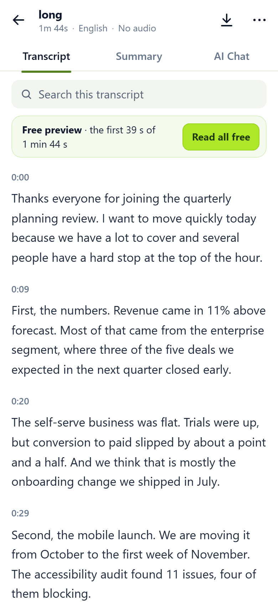</td>
</tr></table>

- One bar on top: back, name, download, more. Search moved into the page as a
  field, where phones put it.
- Left-aligned text with no hyphens. Justified text at this width stretched
  "Revenue came in 11% above forecast" across the whole line.
- Lines are re-cut into sentences and grouped into paragraphs with one time
  each. The API splits segments on pauses, so "…several people have a hard" /
  "stop at the top of the hour." used to be two rows with two times. The word
  timings the API returns are enough to re-cut on sentence ends.
- Times sit above each paragraph instead of in a 60 px gutter, so the text
  gets the full width.
- No player when there is no audio. The biggest thing on screen was a play
  button that could not play. "No audio" is in the line under the name, and
  File details says why (previews keep audio for 3 days).
- The keep-reading bar is gone from the bottom. The preview is named once at
  the top, with the product's lime button, and asked for properly where it
  ends.

Kept: the three tabs, the green and lime (sampled from the screenshots), and
the header scrolling away.

### At 320 px

<table><tr><th>Now</th><th>Next</th></tr><tr>
<td></td>
<td>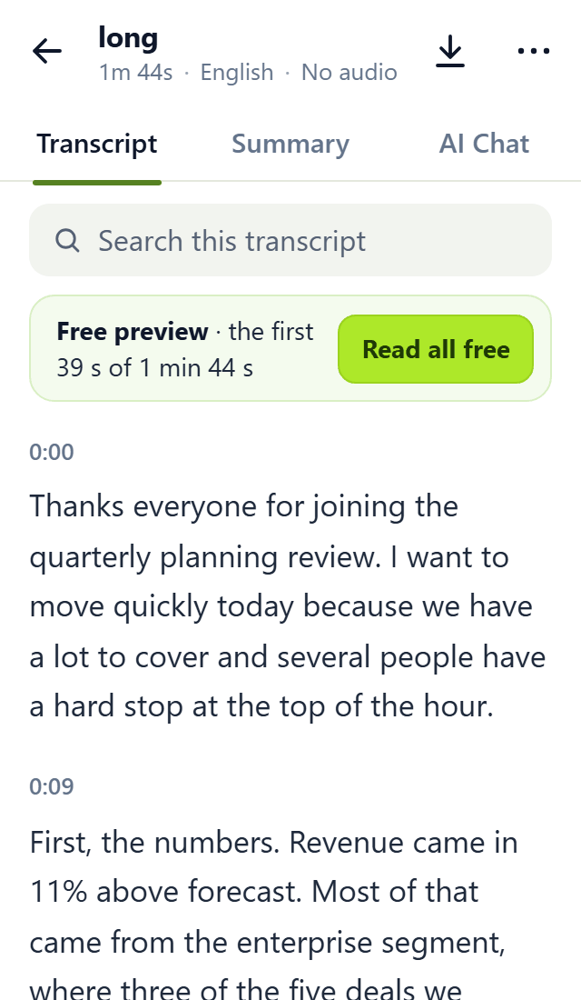</td>
</tr></table>

- The line under the name never truncates. It shortens "English" to "EN", then
  drops it, before it would cut anything. The script measures it.
- The preview line wraps instead of ending in "(first 48%)....".

### Scrolled, and where the preview ends

<table><tr><th>Now</th><th>Next</th><th>Now</th><th>Next</th></tr><tr>
<td></td>
<td>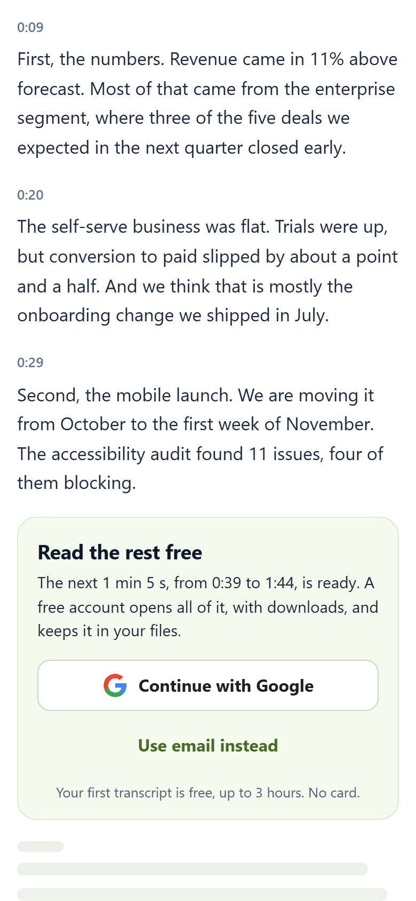</td>
<td></td>
<td>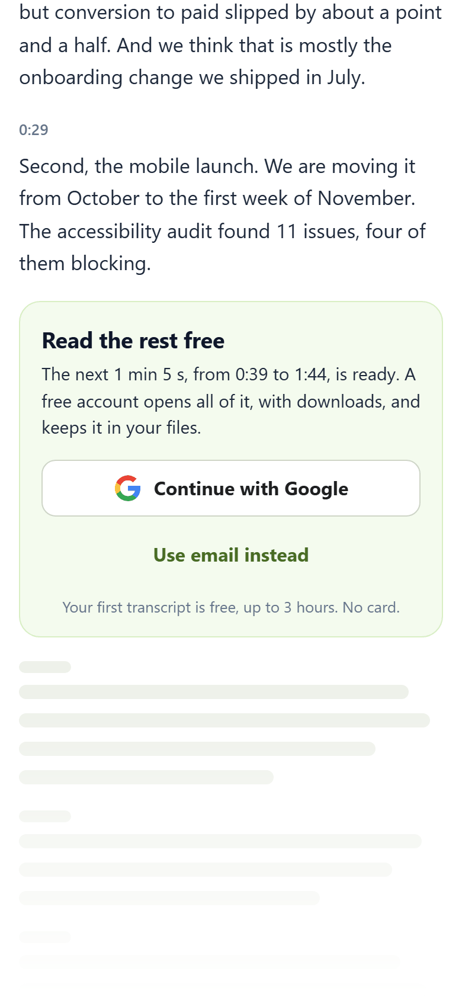</td>
</tr></table>

- Without audio nothing is pinned. With audio, one 76 px player stays,
  about half of the old 157 px stack.
- The end of the preview says what is left in time: "the next 1 min 5 s, from
  0:39 to 1:44". "48% read" reads like a score, and nobody thinks in percent of
  a file.
- Continue with Google is on the page: two taps to the whole transcript
  instead of three, and no modal.
- Faded lines show there is more without leaking any of it.
- One message instead of two: the old truncated bar repeated the end note.

### Search

<table><tr><th>Now</th><th>Next: results</th><th>Next: in the transcript</th></tr><tr>
<td></td>
<td>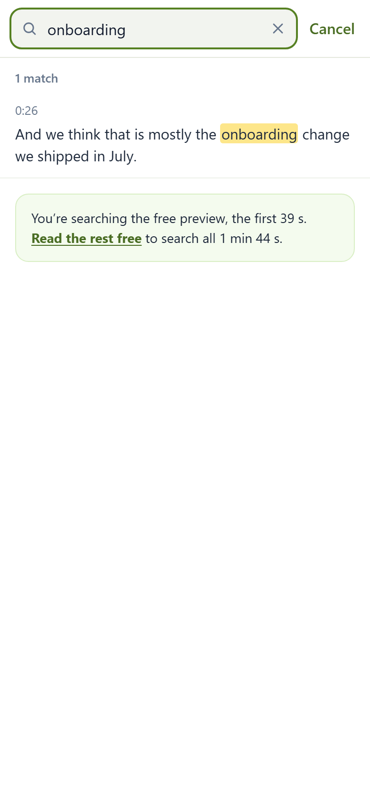</td>
<td>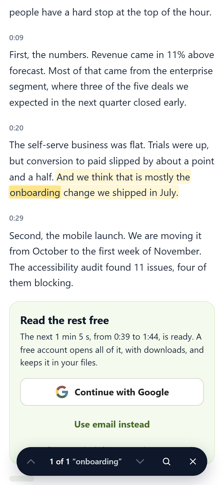</td>
</tr></table>

- Search is a mode: the field takes the top, the keyboard comes up, and the
  results are the lines that match, with their times.
- A result takes you to the line in the transcript, marked, with a bar to step
  through matches. Before, the match showed twice: pinned in a card, and still
  at 0:26 in a transcript that stayed at 0:00.
- A guest is told they are searching the preview only.
- Previous and next are 44 px targets, up from about 24.

### Download

<table><tr><th>Now</th><th>Next: guest</th><th>Next: your file</th></tr><tr>
<td></td>
<td>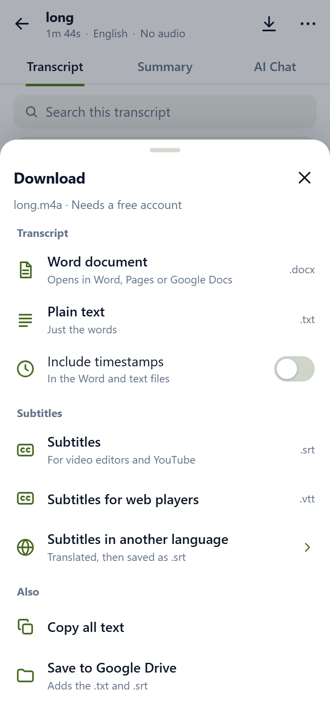</td>
<td>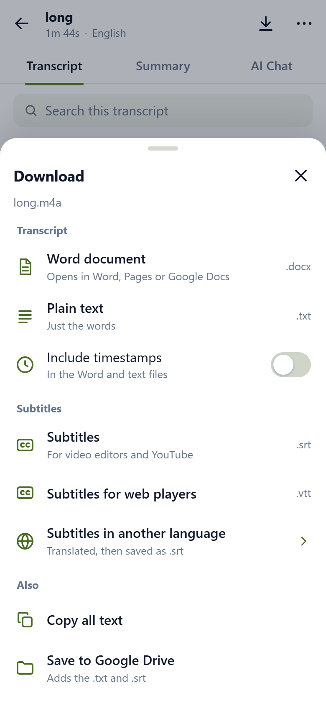</td>
</tr></table>

- Formats are named for what people do with them ("Word document: opens in
  Word, Pages or Google Docs"). The extension stays on the right for people
  who know it.
- Grouped by job. Copy all text moved here from the More menu, since copying
  is another way of taking the text away.
- Summary downloads moved to the Summary tab: the button downloads what you
  are looking at.
- A guest picks a format first, then signs up, and the download starts once
  they are in.

### More menu and reading settings

<table><tr><th>Now</th><th>Next</th><th>Now</th><th>Next</th></tr><tr>
<td></td>
<td>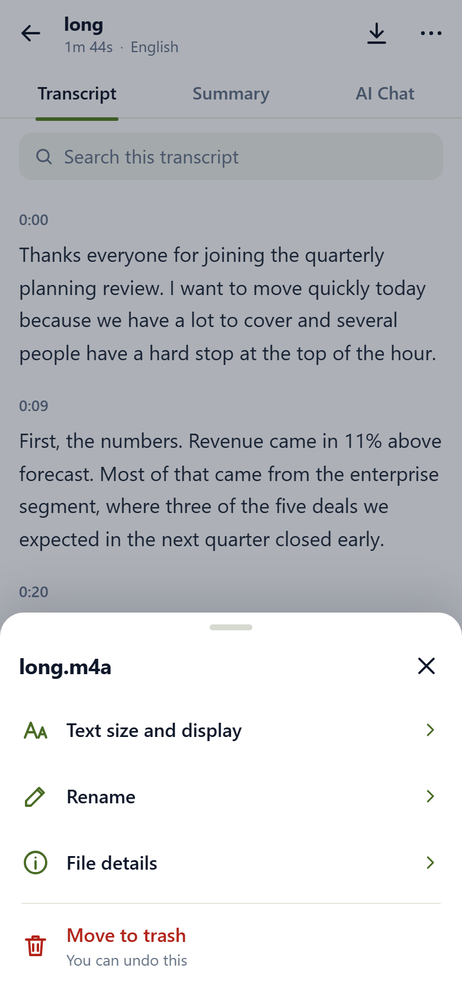</td>
<td></td>
<td>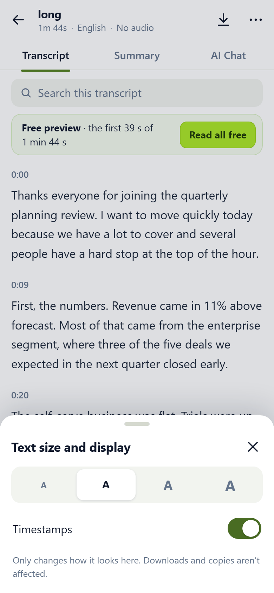</td>
</tr></table>

- Nine items become four for the owner and two for a guest. Gone: Home (the
  back arrow), "Timestamps: shown" (a copy of reading settings), Sign in (the
  preview asks for it), Copy (now in Download), Quiz (now in AI Chat, next to
  the other questions).
- Delete becomes Move to trash with Undo, instead of a confirm. The API
  already keeps a trash (`GET /v1/jobs/trash`, `POST /v1/jobs/{id}/restore`).
- Rename and trash only appear on your own file.
- Text size is four buttons you can see, not a dropdown, and the text behind
  the lighter backdrop changes as you tap. Speaker names only shows with more
  than one speaker; Follow the audio only with audio.

Kept: "Only changes how it looks here". Good copy.

### Selecting a line

<table><tr><th>Now</th><th>Next</th></tr><tr>
<td></td>
<td>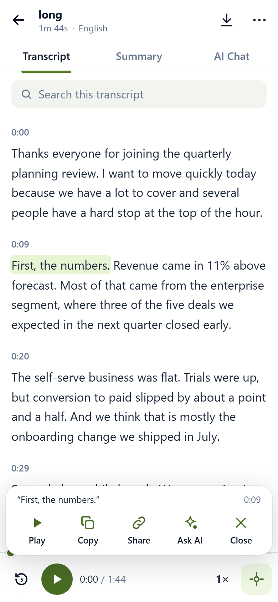</td>
</tr></table>

- Tap a line and its actions sit at the bottom, in thumb reach, instead of a
  dark bubble over the next line. Long-press still gives the phone's own
  selection; the page no longer draws a menu on top of it.
- Copy includes the time and the file: "First, the numbers." (long.m4a, 0:09).
- Play only shows when there is audio. Share and Ask AI are new.

### Keep reading → sign up

<table><tr><th>Now</th><th>Next</th><th>Next: code</th></tr><tr>
<td></td>
<td>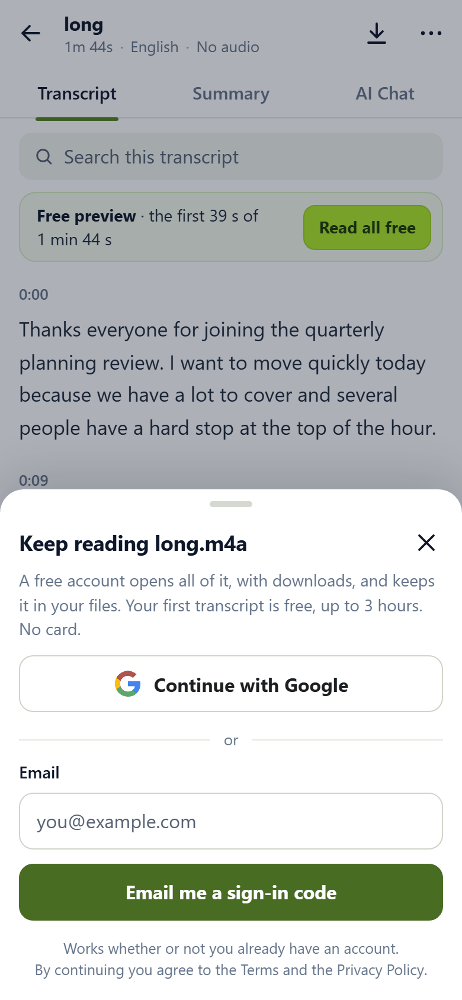</td>
<td>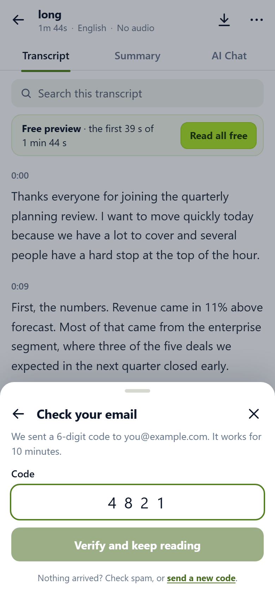</td>
</tr></table>

- A bottom sheet in the product's green, not a centred purple modal. The field
  is near the top, so the keyboard does not cover it.
- The title says what you get: "Keep reading long.m4a".
- No password and no Sign in / Sign up tabs. Google, or a 6-digit code by
  email, works whether you have an account or not. The code field uses
  `autocomplete="one-time-code"`, so phones offer the code.
- After sign-in you land on the same line and the rest fades in.

### Load failure, and not on this account

<table><tr><th>Now</th><th>Next</th><th>Now</th><th>Next: signed in</th><th>Next: signed out</th></tr><tr>
<td></td>
<td>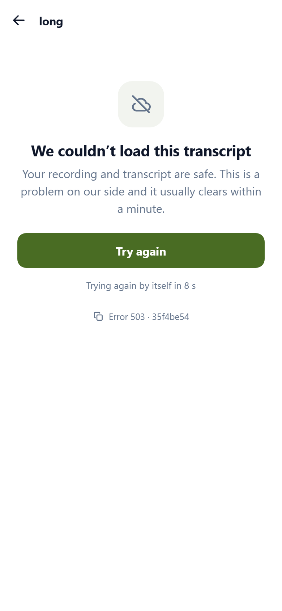</td>
<td></td>
<td>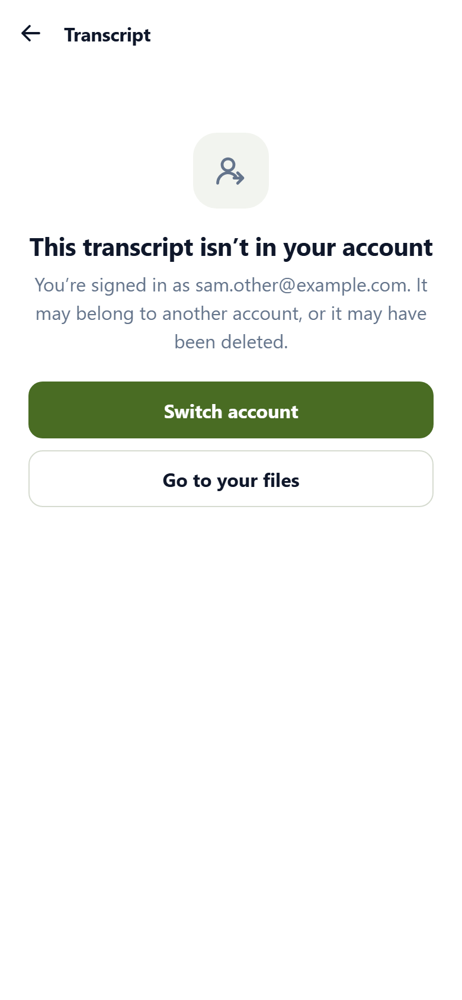</td>
<td>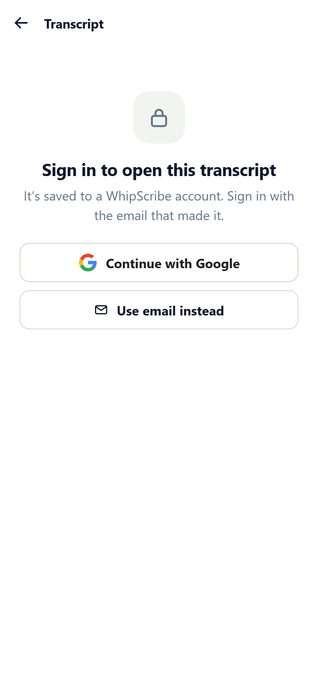</td>
</tr></table>

- The error says what happened in words and that the recording is safe. "HTTP
  503" becomes a small reference with a copy button, for support. It retries
  by itself with a countdown. Offline gets its own message.
- No tabs, search or download while there is nothing to act on.
- "Not on this account" no longer says "Loading…" for ever. Signed in and
  signed out are different problems, so they get different screens.
- It does not claim whose account the file is on: the API deliberately answers
  404 for "not yours", so the page cannot know.

### New: while it transcribes, and when there is nothing to read

<table><tr><th>Transcribing</th><th>No speech found</th></tr><tr>
<td>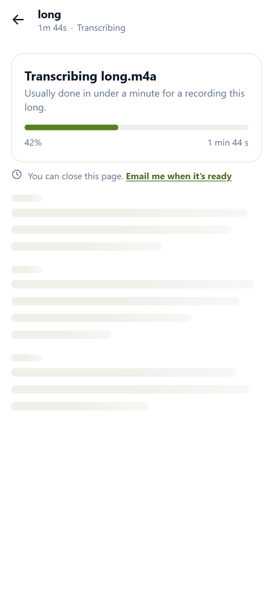</td>
<td>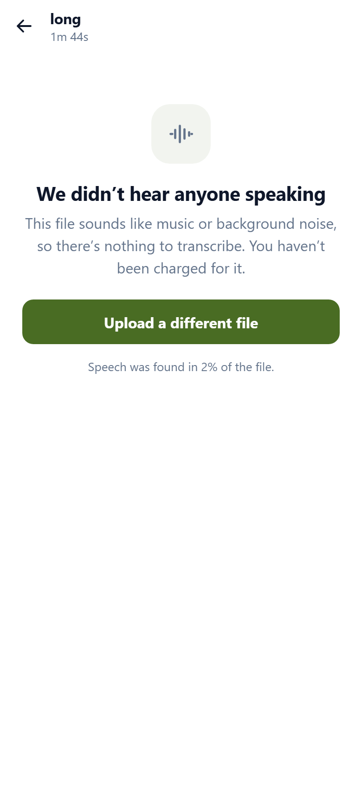</td>
</tr></table>

- Built from what the API reports: `queued`, then `processing` with a
  `progress` value, then `done` or `failed`. The estimate uses the docs'
  "about two minutes for an hour".
- It says you can leave. A guest can ask for an email when it is ready.
- No speech found (`speech_detected: false`) and a failed job both say you were
  not charged, which the docs promise.

### New: four speakers at 320 px

<table><tr><th>Four speakers</th><th>Renaming one</th></tr><tr>
<td>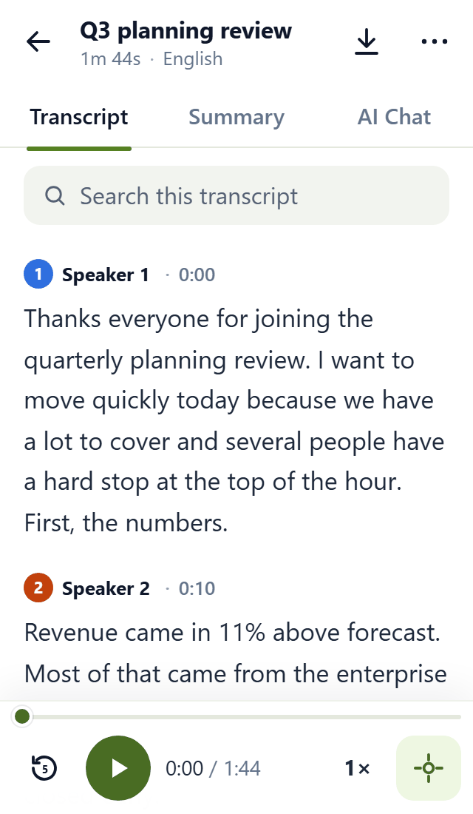</td>
<td>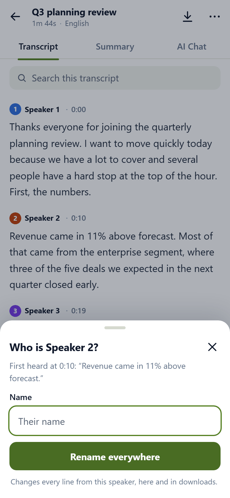</td>
</tr></table>

- Each turn starts with a coloured initial and the name. The number or letter
  is always there, so colour is never the only signal.
- Consecutive lines from one person become one paragraph. A short interjection
  like "Do we know why?" keeps its own turn.
- Tap a name to rename that speaker everywhere, with the first thing they said
  as a reminder of who it was.

### New: with audio

<table><tr><th>Playing</th><th>Scrolled away</th></tr><tr>
<td>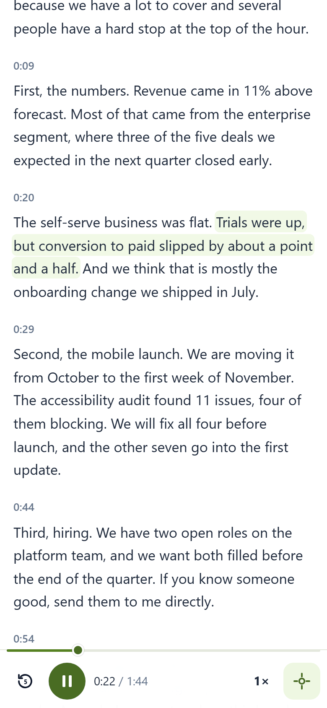</td>
<td>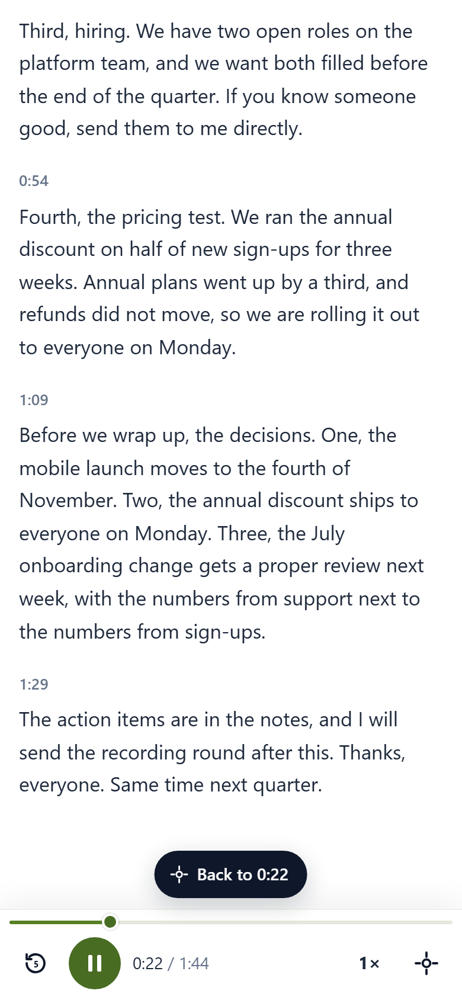</td>
</tr></table>

- One slim player: back 5 s, play, time, speed, follow. The progress line is
  also the scrubber.
- The line being played is shaded and the page follows it. Scroll away and it
  stops following and offers "Back to 0:22", the job the desktop's unlabelled
  ↑ • ↓ control does without words.

### Desktop

The prototype is the same code at 1280 px: a centred column, nothing broken.
What I would carry to the real desktop page:
- the preview ask at the end of the preview rather than above the first line
  (it pushes the transcript about 400 px down today),
- paragraphs instead of one row per segment,
- the copy.

Bugs I saw in the desktop screenshot:
- the sidebar says QUEUED for a transcript that is open and done,
- the same file is listed twice,
- the floating ↑ • ↓ control has no label.

## The questions in the brief

**What is the one thing a person on a phone came here to do, and how many taps
away is it?** Read what was said, or find one thing that was said. Reading is
zero taps and now gets the screen. Finding is one tap on a search field at the
top of the transcript, instead of an icon.

**The keep-reading bar and the player take the bottom. Right trade? And with
the keyboard up?** No. A bar that is always there stops being read, and it cost
157 px on every screen. The ask now comes where people decide: at the end of the
preview, on picking a download, and when search runs out of preview. The player
only exists when there is audio. With the keyboard up, search is its own layer
and nothing is pinned to the bottom.

**Nine items in the More menu: which belong?** Four for the owner, two for a
guest. See above for where the other five went.

**Search, download, settings: should they feel like one?** Download, More,
settings, sign-up, rename and details are now one sheet component: same handle,
title, close button and rows. Search is different on purpose. It needs the
keyboard and the whole screen, so it is a mode, not a panel.

**What does the reader look like while it is still processing?** Designed
above, from the states the API reports.

**Four speakers at 320 px?** Above.

**Text selection: what should happen after you select a line?** Its actions,
at the bottom: play from there, copy with the time, share, ask AI about it.

**Should the desktop page change?** Mostly no. Its layout suits a wide screen.
The shared pieces should carry over; the list is above.

## What I would check with the team first

- **Email code for existing accounts.** The API has
  `/v1/auth/signup-otp/start` and `/verify`; I assumed the same code can sign
  in an existing account. If it cannot, keep a small "Sign in with a password"
  link.
- **Matches after the preview.** A guest's search only sees the preview slice.
  A server-side count ("3 more matches after the preview") would make that
  message much stronger, and it needs an endpoint that does not exist in the
  public docs.
- **Speaker names** need somewhere to be stored; the public docs do not show
  one.
- **Why the audio is missing.** I used the `AUDIO_EXPIRED` code and its
  `retention_days`; `AUDIO_MISSING` would say "no audio was saved" instead.

## Not done

- Tested in Chromium with phone emulation at 320, 375 and 390 px, not yet on a
  real iPhone or Android phone.
- Playback is simulated. There is no audio file behind the prototype, so the
  shading moves but nothing plays.
- The Summary and AI Chat tabs are entry points only; I did not redesign them.
- No dark mode, no landscape layout, and no swipe-to-close on sheets
  (close button, backdrop and Escape work).

## How it is built

- `reader.html`, `reader.css`, `reader.js`: no build step and no dependencies,
  so it opens on a phone as it is.
- `data.js`: two made-up recordings in the shapes the API documents
  (`GET /v1/jobs/{id}` and `GET /v1/jobs/{id}/result?format=json`), with the
  locked preview as its own slice. The segment breaks of `long.m4a` are copied
  from the current screenshots, including the mid-sentence ones, so the
  before and after show the same content.
- Checked against a real response. I sent a 53-second two-voice recording I
  made to `POST /v1/transcribe`. The result came back with `"words": null` and
  `"speaker": null` on every segment, although the docs say both default to
  on. So the reader does not depend on them: without word times it spreads a
  segment's words across its span to re-cut sentences, and without speakers it
  shows no names. I asked about the mismatch in a Question issue.
- Accessibility: 44 px targets, tabs that work with arrow keys, dialogs that
  handle focus and close on Escape, labels on every icon button, reduced motion
  respected. Body text is `#1e293b` on white (14.6:1), secondary text
  `#64748b` (4.8:1), and text on the grey search field and the lime tint is
  `#556174` (5.7:1). I checked these by calculation, not with a tool.

I kept the parts I could defend screen by screen
and threw out the rest. Screenshotting every state at 320 and 390 px caught
things I then fixed:
- the title clipped by a default paragraph margin,
- "falsefalse" printed into a sheet,
- a 1 px tab underline showing under the hidden header,
- the preview end reading 0:38 in one place and 39 s in another,
- a "follow" icon identical to download,
- a title and a meta line truncating ("Q3 planning review.…", "4 spea…") in
  exactly the way I criticise above.

The first version had two grey notices at the top of the transcript. They
took 75 px and read as noise, so they became one tinted line.
